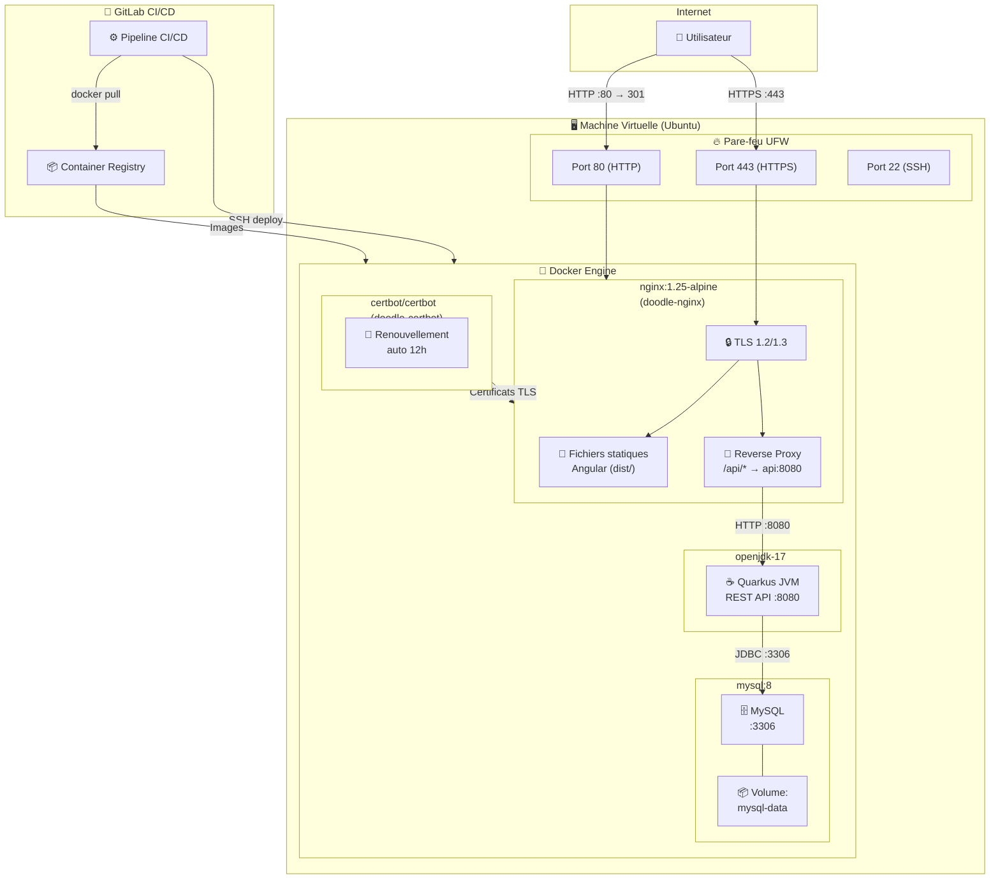

# Compte-rendu — Projet TLC : Ops et Cloud

## 🚀 Déploiement en un clic

> **Prérequis** : Docker et Docker Compose installés sur la machine.

[](#)

```bash
docker compose up -d --build
```

Cette unique commande :
1. **Build** l'image du back Quarkus (`Dockerfile.api`) — compilation Maven multi-stage
2. **Build** l'image du front Angular + Nginx (`Dockerfile.frontend`) — compilation `ng build` multi-stage
3. **Démarre** la base de données MySQL 8 (avec healthcheck)
4. **Démarre** l'API Quarkus (attend que la BD soit healthy)
5. **Démarre** Nginx qui sert le front et proxifie `/api/*` vers le back

➡️ L'application est ensuite accessible sur **http://localhost**.

> Pour un déploiement HTTPS local (certificat auto-signé) :
> ```bash
> ./scripts/generate-local-cert.sh
> docker compose -f docker-compose.local-ssl.yml up -d --build
> ```

---

## Tâche 1 — Dockerfiles et Docker Compose

### Ce qui a été fait

- **`Dockerfile.api`** : Build multi-stage du backend Quarkus.
  - *Stage 1* : compilation Maven (`maven:3.9-eclipse-temurin-17`) — `mvn package -DskipTests`
  - *Stage 2* : image de runtime légère (`ubi8/openjdk-17`) contenant uniquement le JAR Quarkus
- **`Dockerfile.frontend`** : Build multi-stage du frontend Angular.
  - *Stage 1* : `npm ci && ng build --production` dans `node:18-alpine`
  - *Stage 2* : le résultat de build est copié dans `nginx:1.25-alpine`
- **`docker-compose.yml`** : Orchestration locale des 3 services :
  | Service | Image | Port exposé |
  |---------|-------|-------------|
  | `nginx` | Build depuis `Dockerfile.frontend` | 80 |
  | `api` | Build depuis `Dockerfile.api` | — (interne 8080) |
  | `db` | `mysql:8` | — (interne 3306) |
- Toutes les variables d'environnement sont configurables via des valeurs par défaut (`${VAR:-default}`)
- Volume persistant `mysql-data` pour la base de données
- Healthcheck MySQL avant le démarrage de l'API (`depends_on: condition: service_healthy`)

### Fichiers concernés

| Fichier | Rôle |
|---------|------|
| `Dockerfile.api` | Image Docker du backend Quarkus |
| `Dockerfile.frontend` | Image Docker du frontend Angular + Nginx |
| `docker-compose.yml` | Orchestration locale (dev) |
| `.env` | Variables d'environnement par défaut |

---

## Tâche 2 — Configuration Nginx (reverse proxy / gateway API)

### Ce qui a été fait

- **`nginx/nginx.conf.template`** : Fichier de configuration Nginx servant de point d'entrée unique :
  - Sert les fichiers statiques Angular depuis `/usr/share/nginx/html`
  - Supporte le routage HTML5 d'Angular (`try_files $uri $uri/ /index.html`)
  - **Proxifie** les requêtes `/api/*` vers le backend Quarkus (`proxy_pass http://api_backend/api/`)
  - En-têtes proxy correctement positionnés (`X-Real-IP`, `X-Forwarded-For`, `X-Forwarded-Proto`)
- Résout le problème de CORS en faisant transiter toutes les requêtes front + API par le même origin (port 80)

### Fichiers concernés

| Fichier | Rôle |
|---------|------|
| `nginx/nginx.conf.template` | Config Nginx HTTP (dev / local) |
| `nginx/nginx-ssl.conf.template` | Config Nginx HTTPS (prod / local-ssl) |

---

## Tâche 3 — Déploiement sur VM (DNS, Let's Encrypt, UFW)

### Ce qui a été fait

- **`docker-compose.prod.yml`** : Compose de production utilisant des images pré-buildées (tirées depuis le registry GitLab) + certbot pour la gestion automatique des certificats TLS.
  - Service `certbot` en boucle de renouvellement (toutes les 12 h)
  - Volumes partagés `certbot-certs` / `certbot-www` entre Nginx et Certbot
- **`nginx/nginx-ssl.conf.template`** : Configuration Nginx avec TLS :
  - Redirect HTTP → HTTPS (301)
  - Route ACME challenge (`/.well-known/acme-challenge/`) vers le webroot Certbot
  - Protocoles TLS 1.2 / 1.3, ciphers forts, HSTS
  - Variable d'environnement `${DOODLE_DOMAIN}` pour le `server_name`
- **`scripts/init-letsencrypt.sh`** : Script d'initialisation Let's Encrypt :
  1. Crée un certificat auto-signé temporaire pour démarrer Nginx
  2. Demande un vrai certificat via le challenge HTTP-01
  3. Recharge Nginx avec le certificat valide
- **`scripts/setup-firewall.sh`** : Configuration UFW :
  - Deny all incoming par défaut
  - Allow SSH (22), HTTP (80), HTTPS (443)
- **`docker-compose.local-ssl.yml`** : Variante pour tester HTTPS en local avec un certificat auto-signé
- **`scripts/generate-local-cert.sh`** : Génère un certificat auto-signé pour `localhost`

### Fichiers concernés

| Fichier | Rôle |
|---------|------|
| `docker-compose.prod.yml` | Compose de production (images registry + certbot) |
| `docker-compose.local-ssl.yml` | Compose HTTPS local (certificat auto-signé) |
| `nginx/nginx-ssl.conf.template` | Config Nginx HTTPS |
| `scripts/init-letsencrypt.sh` | Bootstrap Let's Encrypt |
| `scripts/setup-firewall.sh` | Configuration pare-feu UFW |
| `scripts/generate-local-cert.sh` | Certificat auto-signé local |
| `.env` | Domaines, credentials, config SMTP, etc. |

---

## Tâche 4 — Diagramme de déploiement

### Architecture de déploiement



### Diagramme de déploiement UML (notation simplifiée)

```
┌─────────────────────────────────────────────────────────────────────┐
│                    «execution environment»                         │
│                    Machine Virtuelle Ubuntu                        │
│                                                                     │
│  ┌──────────────────────────────────────────────────────────────┐  │
│  │                     «firewall» UFW                           │  │
│  │              Allow: 22/tcp, 80/tcp, 443/tcp                  │  │
│  └──────────────────────────────────────────────────────────────┘  │
│                                                                     │
│  ┌──────────────────────────────────────────────────────────────┐  │
│  │                   «container engine» Docker                  │  │
│  │                                                              │  │
│  │  ┌──────────────────┐   ┌───────────────┐   ┌────────────┐  │  │
│  │  │ «container»      │   │ «container»   │   │ «container»│  │  │
│  │  │ doodle-nginx     │──▶│ doodle-api    │──▶│ doodle-db  │  │  │
│  │  │                  │   │               │   │            │  │  │
│  │  │ nginx:1.25-alpine│   │ openjdk-17    │   │ mysql:8    │  │  │
│  │  │ :80, :443        │   │ :8080         │   │ :3306      │  │  │
│  │  │                  │   │               │   │            │  │  │
│  │  │ «artifact»       │   │ «artifact»    │   │ «volume»   │  │  │
│  │  │ Angular dist/    │   │ quarkus-run   │   │ mysql-data │  │  │
│  │  │ nginx.conf       │   │   .jar        │   │            │  │  │
│  │  └──────────────────┘   └───────────────┘   └────────────┘  │  │
│  │                                                              │  │
│  │  ┌──────────────────┐                                        │  │
│  │  │ «container»      │                                        │  │
│  │  │ doodle-certbot   │─ ─ ─▶ volumes: certbot-certs,         │  │
│  │  │ certbot/certbot  │        certbot-www (partagés avec     │  │
│  │  │ renew @12h       │        nginx)                          │  │
│  │  └──────────────────┘                                        │  │
│  └──────────────────────────────────────────────────────────────┘  │
└─────────────────────────────────────────────────────────────────────┘

        ▲ SSH (deploy)                    ▲ docker pull
        │                                 │
┌───────┴─────────────────────────────────┴────────┐
│              «CI/CD» GitLab CI                    │
│  ┌─────────┐   ┌─────────┐   ┌─────────────────┐ │
│  │  build  │──▶│  test   │──▶│ deploy (auto)   │ │
│  │         │   │ (smoke) │   │ branche 'deploy'│ │
│  └─────────┘   └─────────┘   └─────────────────┘ │
│                                                    │
│  «artifact store» GitLab Container Registry       │
│  ├── registry/api:sha    registry/api:latest      │
│  └── registry/nginx:sha  registry/nginx:latest    │
└────────────────────────────────────────────────────┘
```

---

## Aventure 1 — Déploiement continu (GitLab CI/CD)

### Ce qui a été fait

Pipeline CI/CD complet en 3 stages dans `.gitlab-ci.yml` :

| Stage | Job | Déclencheur | Action |
|-------|-----|-------------|--------|
| **build** | `build-images` | Tout commit (toute branche) | Build des images Docker API + Nginx, push sur le GitLab Container Registry avec tag `$CI_COMMIT_SHA`. Sur la branche `deploy` : tag `latest` en plus. |
| **test** | `test-images` | Tout commit (toute branche) | Smoke test : pull des images, démarrage des conteneurs, vérification que Nginx répond (`curl`). |
| **deploy** | `deploy-auto` | Merge sur la branche `deploy` | Déploiement automatique sur la VM via SSH (script `deploy.sh`). |
| **deploy** | `deploy-manual` | Branche `main` uniquement | Déploiement manuel (bouton dans GitLab). |

### Workflow de déploiement

1. Le développeur pousse du code sur `main`
2. Le pipeline build + test se déclenche automatiquement
3. Une Merge Request `main → deploy` est créée
4. Au merge, le job `deploy-auto` se déclenche et déploie sur la VM
5. Le script `deploy.sh` transfère les fichiers via SCP et lance `docker compose up -d`

### Scripts de support

| Script | Rôle |
|--------|------|
| `scripts/build.sh` | Build + push des images sur le registry GitLab |
| `scripts/deploy.sh` | Déploiement via SSH sur la VM distante |

### Fichiers concernés

| Fichier | Rôle |
|---------|------|
| `.gitlab-ci.yml` | Définition du pipeline CI/CD (3 stages) |
| `scripts/build.sh` | Build et push des images Docker |
| `scripts/deploy.sh` | Déploiement automatisé via SSH |

---

## Récapitulatif des fichiers du projet

| Fichier | Tâche(s) | Description |
|---------|----------|-------------|
| `Dockerfile.api` | T1 | Image Docker backend (Quarkus, multi-stage) |
| `Dockerfile.frontend` | T1, T2 | Image Docker frontend (Angular + Nginx, multi-stage) |
| `docker-compose.yml` | T1 | Orchestration locale (dev) |
| `docker-compose.prod.yml` | T3 | Orchestration production (images registry + certbot) |
| `docker-compose.local-ssl.yml` | T3 | Orchestration HTTPS locale (test) |
| `nginx/nginx.conf.template` | T2 | Config Nginx HTTP + reverse proxy API |
| `nginx/nginx-ssl.conf.template` | T2, T3 | Config Nginx HTTPS + TLS + ACME |
| `.env` | T1, T3 | Variables d'environnement |
| `.gitlab-ci.yml` | A1 | Pipeline CI/CD GitLab |
| `scripts/build.sh` | A1 | Build + push images |
| `scripts/deploy.sh` | A1 | Déploiement SSH |
| `scripts/init-letsencrypt.sh` | T3 | Bootstrap Let's Encrypt |
| `scripts/setup-firewall.sh` | T3 | Configuration UFW |
| `scripts/generate-local-cert.sh` | T3 | Certificat auto-signé local |
